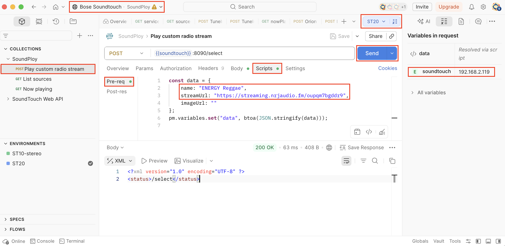

# SoundPloy v2

This service is about re-enabling Bose SoundTouch devices to play radio streams.
The target audience are users who don't want to tinker with their own servers
(e.g. like using [soundcork](https://github.com/deborahgu/soundcork)).
It uses a [php script](https://github.com/gmuth/soundploy/blob/main/v2/orion/station.php) hosted in germany and can be used for free.

## Pre-requisites

- You should know or learn how to use `telnet` and `Postman`
- The device is NOT reset to factory settings (see `1005 UNKNOWN_SOURCE_ERROR` below)

## Configure device

You will change the `bmxRegistryUrl` to point to the SoundPloy service.

### Use telnet interactive

[Telnet to the device using port 17000](https://www.youtube.com/watch?v=yfa0RaGVpyY) and run the following commands:
```
sys configuration bmxRegistryUrl http://soundploy.gmuth.de/v2/services
envswitch boseurls set https://marge.bose.com https://worldwide.bose.com/updates/soundtouch
sys reboot
```

### Automated configuration with expect

Power users can use the cli tool [expect](https://linux.die.net/man/1/expect) to automate the commands from above:

`SOUNDTOUCH="192.168.2.105" curl -s http://soundploy.gmuth.de/v2/configure_soundtouch | expect -f -`

## Lookup stream url

Check out the website of your favorite radio station and look for the stream url.
Or use a station directory which lists the stream url.
- [streamurl.link](https://streamurl.link)
- [radio-browser.info](https://www.radio-browser.info)

## Start custom radio stream

We'll use the [orion station API](https://github.com/gmuth/soundploy/blob/main/v2/orion/station.php) for this and send a POST request to the device using [Postman](https://getpostman.com).



1. Start Postman (desktop application) and open [workspace Bose SoundTouch](https://soundploy-1806940.postman.co/workspace/70cec626-e5cf-4cd5-884e-80bd4a7ca40c)
2. Navigate to [collection SoundPloy](https://www.postman.com/soundploy-1806940/bose-soundtouch/collection/5y09857/soundploy) and request _Play custom radio stream_
3. Select an existing environment or create a new one 
4. Set variable `soundtouch` to the IP address of your device
5. Navigate to _Scripts > Pre-request_
6. Change the values of `name` and `streamUrl`
7. Click _Send_

Now your device should start playing the stream.

### 1005 UNKNOWN_SOURCE_ERROR

This means that source `LOCAL_INTERNET_RADIO` is not available.
Adding this source is a one-time operation.
You can try one of those methods:
- [SoundPloy V1](https://gist.github.com/gmuth/3cb7945df6654a965a8a4c60de2627b5) - This method requires root access to the device.
- [SoundCork](https://github.com/deborahgu/soundcork) - After you successfully played a stream once you can stop SoundCork and use SoundPloy.


## Save radio stream to preset

Press and hold the desired preset button on your device or remote until you hear a beep.
